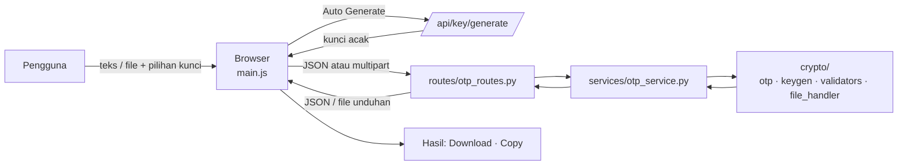

<div align="center">

# 🔐 OTiPad

### One Time Pad Program — *Encrypt & Decrypt, One More Time with Us!*

Aplikasi web untuk mengenkripsi dan mendekripsi **teks** maupun **file** dengan metode **One-Time Pad (OTP)**.


*Dibuat oleh **Kelompok 5** — Mata Kuliah Kriptografi*

</div>

---

## 📑 Daftar Isi

- [Tentang Proyek](#-tentang-proyek)
- [Fitur](#-fitur)
- [Teknologi](#-teknologi)
- [Alur Kerja](#-alur-kerja)
- [Struktur Proyek](#-struktur-proyek)
- [Instalasi](#-instalasi)
- [Menjalankan Aplikasi](#-menjalankan-aplikasi)
- [Cara Menggunakan](#-cara-menggunakan)
- [Dokumentasi API](#-dokumentasi-api)
- [Konsep One-Time Pad](#-konsep-one-time-pad)
- [Catatan Keamanan](#-catatan-keamanan)
- [FAQ](#-FAQ)
- [Tim Pengembang](#-tim-pengembang)

---

## 📖 Tentang Proyek

**OTiPad** adalah aplikasi web berbasis **Flask** untuk mendemonstrasikan algoritma **One-Time Pad**, yaitu sandi yang secara teori tidak dapat dipecahkan selama kuncinya acak, sama panjang dengan pesan, dan hanya dipakai satu kali.

Pengguna dapat memasukkan **teks** atau **file**, memilih mode **Encrypt** atau **Decrypt**, lalu menentukan sumber kunci: ditulis sendiri, dibuat otomatis, atau memakai kunci bawaan. Tampilannya responsif untuk desktop maupun HP.

> **Catatan:** proses enkripsi dan dekripsi dijalankan di **server** (Python). Browser hanya mengirim permintaan dan menampilkan hasilnya.

---

## ✨ Fitur

| Kategori | Fitur |
| --- | --- |
| **Input** | Teks (ketik atau muat file `.txt`) dan File (semua jenis, drag and drop atau pilih file) |
| **Mode** | Encrypt dan Decrypt |
| **Kunci** | **Manual Input** (ketik atau muat `.txt`), **Auto Generate** (kunci acak, khusus Encrypt), **Default** (kunci template) |
| **Hasil** | Tampil di halaman, bisa **Download**, **Copy** |
| **Kunci otomatis** | Bisa di-**download** `.txt` atau di-**copy** |
| **Keamanan kunci** | Kunci acak dibuat dengan modul `secrets` (kriptografis) dan *rejection sampling* agar tidak bias |
| **Validasi** | Input kosong, kunci tidak valid, kunci terlalu pendek, ukuran file, dan header file rusak |
| **Tampilan** | Responsif penuh (HP sampai desktop) dengan tema pastel *Sugar Rush* |

---

## 🧰 Teknologi

| Bagian | Teknologi |
| --- | --- |
| Backend | Python 3, Flask (Blueprint) |
| Template | Jinja2 (`base.html`, `index.html`, dan *partials*) |
| Frontend | HTML, CSS (variabel dan `clamp()` untuk layout fluid), JavaScript (tanpa framework) |
| Kunci acak | Modul `secrets` Python |
| Font | Zalando Sans Bold (judul), JetBrains Mono Medium (keterangan), Sora Regular (isi) |
| Palet warna | `#ff89bf` `#fec3df` `#ffeea8` `#a0f3ed` `#72f0ec` `#bdc0f7` `#069494` |

---

## 🔄 Alur Kerja



---

## 📁 Struktur Proyek

```
OTiPad/
├── app.py                      # Titik masuk Flask
├── config.py                   # Konfigurasi (MAX_FILE_SIZE, path kunci template, dll.)
├── requirements.txt            # Daftar library Python
├── crypto/                     # Inti algoritma
│   ├── otp.py                  #   Operasi OTP (enkripsi / dekripsi)
│   ├── keygen.py               #   Pembuat kunci acak + pembaca kunci
│   ├── validators.py           #   Validasi input dan kunci dari pengguna
│   └── file_handler.py         #   Pengolahan file dan header file terenkripsi
├── services/
│   └── otp_service.py          # Lapisan logika antara route dan crypto
├── routes/
│   └── otp_routes.py           # Endpoint API (Blueprint)
├── keys/                       # Penyimpanan kunci
├── storage/                    # Penyimpanan data pendukung
├── templates/
│   ├── base.html               # Kerangka halaman (head, header, footer, script)
│   ├── index.html              # Halaman utama
│   └── partials/
│       ├── _tabs.html          #   3 dropdown: input, mode, kunci
│       ├── _input_panel.html   #   Kotak input teks dan area file
│       ├── _key_panel.html     #   Kotak kunci manual
│       └── _result_panel.html  #   Hasil dan kunci otomatis
├── static/
│   ├── css/style.css           # Gaya (fluid, responsif)
│   ├── img/                    # Aset desain (header, kotak, tombol, maskot, footer)
│   └── js/
│       ├── main.js             #   State UI, submit, aksi hasil
│       ├── key_mode.js         #   Menentukan jenis dan nilai kunci
│       ├── text_mode.js        #   Alur mode teks + muat file .txt
│       └── file_mode.js        #   Alur mode file + dropzone
└── tests/                      # Pengujian
```

---

## ⚙️ Instalasi

**Prasyarat**

- [Python 3.9+](https://www.python.org/downloads/) (centang **Add Python to PATH** saat instalasi)
- [Git](https://git-scm.com/)
- [VS Code](https://code.visualstudio.com/) (disarankan)

### 1. Clone proyek

```bash
git clone https://github.com/USERNAME/OTiPad.git
cd OTiPad
```

> Ganti `USERNAME` dengan akun GitHub pemilik repository.

### 2. Buat dan aktifkan virtual environment

**Windows (PowerShell)**

```powershell
python -m venv venv
Set-ExecutionPolicy -Scope CurrentUser RemoteSigned   # cukup sekali
venv\Scripts\activate
```

**macOS / Linux**

```bash
python3 -m venv venv
source venv/bin/activate
```

Jika berhasil, muncul `(venv)` di awal baris terminal.

### 3. Install dependensi

```bash
pip install -r requirements.txt
```

Jika `requirements.txt` masih kosong: `pip install flask`, lalu `pip freeze > requirements.txt`.

---

## ▶️ Menjalankan Aplikasi

```bash
python app.py
```

Buka di browser:

```
http://127.0.0.1:5000
```

Hentikan server dengan `Ctrl + C`.

> Saat pertama kali dijalankan, aplikasi membuat **kunci template** (`key_template.txt`) secara otomatis jika belum ada. Kunci ini dipakai untuk opsi kunci **Default**.

---

## 🧭 Cara Menggunakan

Halaman utama memiliki tiga dropdown di bagian atas:

| Dropdown | Pilihan |
| --- | --- |
| **Input** | `Text` · `File` |
| **Mode** | `Encrypt` · `Decrypt` |
| **Kunci** | `Manual Input` · `Auto Generate` · `Default` |

### 🔒 Enkripsi teks

1. Pilih **Text → Encrypt**.
2. Ketik pesan di **Input Text**, atau klik **Pilih .txt** / drop file `.txt` ke kotak.
3. Pilih sumber kunci:
   - **Manual Input**: isi kolom **Manual Input Key** (juga bisa dari file `.txt`).
   - **Auto Generate**: kunci acak dibuat otomatis sepanjang pesan.
   - **Default**: memakai kunci template.
4. Klik **Submit**.
5. Ciphertext muncul di **Ciphertext Result**. Gunakan **Download** atau **Copy**.
6. Jika memakai **Auto Generate**, kunci tampil di **Auto-Generate Key**. **Simpan kunci ini** (Download atau Copy), karena diperlukan untuk dekripsi.

### 🔓 Dekripsi teks

1. Pilih **Text → Decrypt**.
2. Tempel ciphertext di kotak input.
3. Pilih **Manual Input** dan isi kunci yang **sama persis** dengan saat enkripsi (atau **Default** jika dulu memakai kunci template).
4. Klik **Submit**. Hasilnya tampil di **Plaintext Result**.

> **Auto Generate** hanya tersedia untuk **Encrypt**. Saat Decrypt, pengguna harus memasukkan kunci yang sudah dimiliki.

### 📄 Enkripsi / dekripsi file

1. Pilih **File** pada dropdown pertama.
2. Drop file ke area yang tersedia, atau klik untuk memilih (semua jenis file diterima).
3. Pilih mode dan kunci seperti pada mode teks, lalu klik **Submit**.
4. Hasil dapat langsung diunduh. File terenkripsi disimpan dengan ekstensi `.dat`, dan saat didekripsi nama file asli dipulihkan.

> Ukuran file dibatasi oleh `MAX_FILE_SIZE` di `config.py`.

---

## 🔌 Dokumentasi API

Semua endpoint bersifat `POST`. Sumber kunci dikirim lewat dua field:

| Field | Nilai | Keterangan |
| --- | --- | --- |
| `key_type` | `template` · `text` · `generated_id` | Jenis sumber kunci |
| `key_value` | string | Isi kunci (`text`) atau id kunci (`generated_id`). Diabaikan untuk `template` |

### Endpoint

| Endpoint | Input | Respons |
| --- | --- | --- |
| `/api/encrypt/text` | JSON `{plaintext, key_type, key_value}` | JSON |
| `/api/decrypt/text` | JSON `{ciphertext, key_type, key_value}` | JSON |
| `/api/encrypt/file` | `multipart/form-data`: `file`, `key_type`, `key_value` | File `.dat` (unduhan) |
| `/api/decrypt/file` | `multipart/form-data`: `file`, `key_type`, `key_value` | File asli (unduhan) |
| `/api/key/generate` | Parameter `length` (panjang kunci) | Kunci acak A-Z |

### Contoh (cURL)

```bash
curl -X POST http://127.0.0.1:5000/api/encrypt/text \
  -H "Content-Type: application/json" \
  -d '{"plaintext":"HELLO","key_type":"text","key_value":"XMCKL"}'
```

### Kode error

| Kode | HTTP | Arti |
| --- | --- | --- |
| `EMPTY_INPUT` | 400 | Input kosong |
| `INVALID_KEY` | 400 | Kunci tidak valid |
| `SHORT_KEY` | 200 | Kunci lebih pendek dari pesan (kondisi yang diharapkan, bukan galat server) |
| `FILE_TOO_LARGE` | 413 | Ukuran file melebihi batas |
| `BAD_HEADER` | 400 | Header file terenkripsi rusak atau tidak dikenali |
| `BAD_REQUEST` | 400 | Permintaan tidak lengkap (misalnya file tidak diunggah) |
| `SERVER_ERROR` | 500 | Kesalahan di server |

---

## 🧮 Konsep One-Time Pad

One-Time Pad bekerja dengan menggabungkan setiap huruf pesan dengan satu huruf kunci. Pada alfabet A-Z (A=0 … Z=25):

```
Enkripsi :  C = (P + K) mod 26
Dekripsi :  P = (C − K) mod 26
```

Contoh:

| | H | E | L | L | O |
| --- | --- | --- | --- | --- | --- |
| **Pesan (P)** | 7 | 4 | 11 | 11 | 14 |
| **Kunci (K)** | X (23) | M (12) | C (2) | K (10) | L (11) |
| **Cipher (C)** | 30 mod 26 = 4 → **E** | 16 → **Q** | 13 → **N** | 21 → **V** | 25 → **Z** |

### Syarat keamanan OTP

1. Kunci **benar-benar acak**. Proyek ini memakai `secrets` dan *rejection sampling* untuk menghindari *modulo bias*.
2. Panjang kunci **sama dengan atau lebih dari** panjang pesan.
3. Kunci **hanya dipakai satu kali**. Pemakaian ulang menghilangkan keamanan.
4. Kunci **dirahasiakan** dan dikirim lewat jalur yang **berbeda** dari ciphertext.

---

## 🛡️ Catatan Keamanan

- Proyek ini dibuat untuk **pembelajaran** (tugas Kriptografi). Jangan dipakai untuk data yang sangat sensitif tanpa audit keamanan.
- Karena enkripsi berjalan di **server**, pesan dan kunci melewati jaringan. Gunakan **HTTPS** jika aplikasi dipublikasikan.
- Opsi kunci **Default** memakai satu kunci tetap, sehingga **bukan** One-Time Pad murni. Gunakan **Auto Generate** atau kunci manual untuk keamanan yang sesungguhnya.
- Jangan membagikan kunci dan ciphertext lewat saluran yang sama.
- Matikan `debug=True` saat aplikasi dipublikasikan.
- Disarankan memasukkan `venv/`, `__pycache__/`, `keys/`, dan `storage/` ke `.gitignore` agar kunci tidak ikut ter-*commit*.

---

## 🩺 FAQ

| Masalah | Solusi |
| --- | --- |
| Halaman hanya menampilkan header dan footer | Route halaman utama harus `render_template('index.html')`, bukan `base.html` |
| Gambar atau CSS tidak muncul (404) | Pastikan aset ada di `static/img/` dan `static/css/`, dengan nama file yang persis sama (huruf besar-kecil). Lalu hard refresh `Ctrl + Shift + R` |
| Tombol tidak bereaksi | Buka DevTools → **Console**. Pastikan `main.js` dimuat paling akhir di `base.html` |
| `404` pada `/api/...` | Pastikan blueprint terdaftar: `app.register_blueprint(otp_bp)` |
| Pesan "Respons key tidak dikenali" | Periksa bentuk respons `/api/key/generate` di DevTools → Network, lalu sesuaikan `static/js/key_mode.js` |
| Pesan "File is X bytes, max is Y" | Ukuran file melebihi `MAX_FILE_SIZE` di `config.py` |
| `fatal: not a git repository` | Jalankan `cd` ke folder proyek terlebih dahulu |
| `running scripts is disabled` | `Set-ExecutionPolicy -Scope CurrentUser RemoteSigned` |
| `python` tidak dikenali | Coba `py app.py`, atau install ulang Python dengan opsi *Add to PATH* |
| `No module named flask` | Aktifkan venv, lalu `pip install flask` |
| `TemplateNotFound` | Folder harus bernama `templates` dan berisi `index.html` |
| Port 5000 sudah dipakai | Ubah menjadi `app.run(debug=True, port=5001)` |

---

## 👥 Tim Pengembang

**Kelompok 5 — Kriptografi**

| No | Nama | NIM | Role|
| --- | --- | --- | --- |
| 1 | *Ardina Vidya S* | *L0124041* | *Kriptanalisis* |
| 2 | *Naomira Aulin A. F* | *L0124067* | *Backend* |
| 3 | *Rifqia Hani M* | *L0124074* | *Backend* |
| 4 | *Sanny Tazkiyah F. H* | *L0124075* | *Frontend* |
| 5 | *Trisa Dwi R* | *L0124079* | *Frontend* |

<div align="center">

*Encrypt & Decrypt, One More Time with Us!* 🔐

</div>